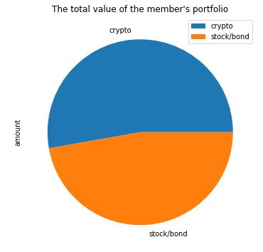
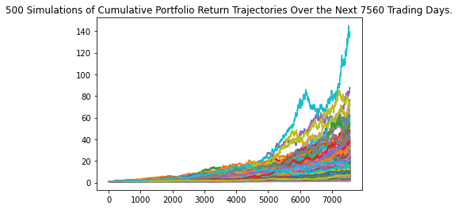
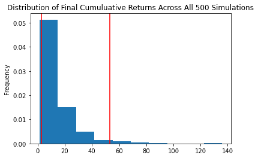
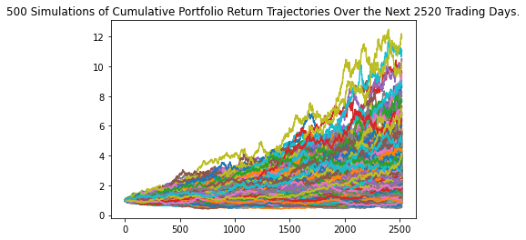
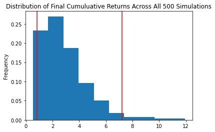

# Financial-Planners-for-Emergencies-and-for-Retirement

Two financial analysis tools (Jupyter notebook):

* A financial planner for emergencies. The user can use it to visualize current savings. 
The user can then determine if he has enough reserves for an emergency fund.

* A financial planner for retirement. This tool forecasts the performance of user's retirement portfolio in N (30 years in current case) years. 
To do this, the tool makes an Alpaca API call via the Alpaca SDK to get historical price data for use in Monte Carlo simulations.

---

## Approach

* Financial Planning with APIs and Simulations

---

## Technologies

This project leverages the following tools for financial analysis:

* [Pandas](https://pandas.pydata.org) - Python library that’s designed specifically for data analysis.

* [JupyterLab](https://jupyter.org) - For running and review Python-based programs.

* [Alpaca SDK](https://https://alpaca.markets) - For making API calls for getting of get historical price data

* [MCForecastTools.py] - For running Monte Carlo simulations.

---

## Input data

```
Amount of cryptos:
btc_coins = 1.2
eth_coins = 5.3
```
```
Amount of stock/bonds:
SPY = 110
AGG = 200
```

Prices data were gotten via API calls.

For running API calls user has to provide:

* ALPACA_API_KEY = "<YOUR ALPACA API KEY HERE!>"
* ALPACA_SECRET_KEY = "<YOUR ALPACA SECRET KEY HERE!>"

## Financial Planner for Emergencies

### Determining the current value of a member’s cryptocurrency wallet.

Current value of the holdings in BTC is $51001.20
Current value of the holdings in ETH is $16812.77
Current cryptocurrency wallet balance is $67813.97

### Evaluate the Stock and Bond Holdings by Using the Alpaca SDK

The current value of the stock portfolio (SPY) is $36800.5.
The current value of the bond portfolio (AGG) is $23889.0.
Total value of bonds and stocks is $60689.5.

### Value of portfolio

Total value of portfolio: $128503.466.



### Evaluate the Emergency Fund

The script is used for evaluating an emergency fund:

```
if total_portfolio > emergency_fund_value:
    print("Congratulating! You have enough money in this fund!")
elif total_portfolio == emergency_fund_value:
    print("Congratulating! You are close to your financial goal!")
else:
    print(f"You are in {emergency_fund_value - total_portfolio} away from your financial goal.")

```

As a result: Congratulating! You have enough money in this fund!


## Financial Planner for Retirement

### Create the Monte Carlo Simulation - 30 years

Preconfiguration data:
```
tickers = ["AGG","SPY"]
timeframe = "1D"
start_date = 2017-08-07
end_date = 2020-08-07
limit_row = 1000

weights = [.40, .60],
num_simulation = 500,
num_trading_days = 252 * 30
```




The lower `95%` confidence outcome is  153625.29
The upper `95%` confidence outcome is  3222808.22

### Create the Monte Carlo Simulation - 10 years

Preconfiguration data:
```
tickers = ["AGG","SPY"]
timeframe = "1D"
start_date = 2017-08-07
end_date = 2020-08-07
limit_row = 1000

weights = [.20, .80],
num_simulation = 500,
num_trading_days = 252 * 10
```




The lower `95%` confidence outcome is  50921.35
The upper `95%` confidence outcome is  437526.48

### Will weighting the portfolio more heavily to stocks allow the credit union members to retire after only 10 years?

Reducing the investment period from 30 years to 10 years, but at the same time increasing the share of shares to 80%, will not make it possible to retire earlier. 
There is a 95% chance that an initial investment of $60689.5 in the portfolio over the next 10 years will end within in the range of $ 50921.35 and 
$ 437526.48 and it is too low for retirement.

---

## Contributors

Vladislav Glupak - [Linkedin](https://www.linkedin.com/in/vladislav-glupak/)

---

## License

It is an Open-source analysis.